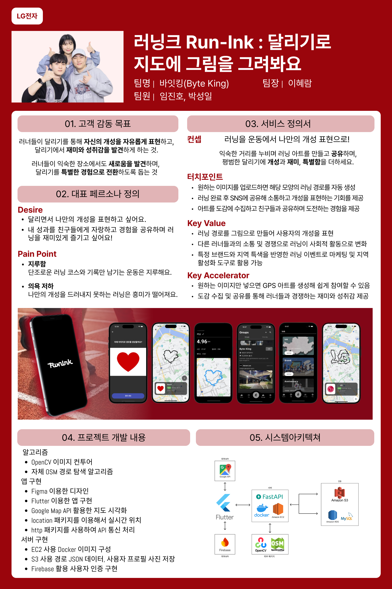

# 🏃‍♀️ RunInk (런잉크)

> **러닝, 운동을 넘어 문화가 되다.**
> 사진 한 장으로 내 위치 기반 **GPS 아트 러닝 경로**를 자동 생성하는 — 개성과 재미 중심의 러닝 앱

<p align="left">
  
  
  
  
  
  
  
  
</p>



📑 **[10분 PT 발표 자료 PDF 보기 →](RunInk_final_10min_pt.pdf)**

---

## ✨ 핵심 차별점

**"사진을 넣기만 하면, 사용자 현재 위치 기반으로 GPS 아트 경로를 자동 생성!"**

| | GPSArtify | Strava | **RunInk** |
|---|:---:|:---:|:---:|
| 사용 요금 | $7.99/월 | 무료 | **무료** |
| GPS 아트 자동 생성 | 업로드 이미지 한정 | 없음 (수작업) | **원하는 모양 자유 지원** |
| 사용자 위치 기반 | ✗ | ✗ | **○** |
| 러닝 앱 내비게이션 | ✗ | ○ | **○** |
| 공유 / 자랑 | ✗ | ○ | **○** |

---

## 🏗 시스템 아키텍처

```
┌─────────────────────────────────────────────────────────────┐
│  📱 Flutter App (iOS / Android) — 30 screens · ~8K LOC      │
│  진호의_공간/RunInk/                                         │
│                                                             │
│  ConvexAppBar 5탭: Rank · Ink · Center · Group · My         │
│  google_maps_flutter · location · http · image_picker       │
│  firebase_auth · google_sign_in · share_plus · fl_chart     │
└──────────────────────────┬──────────────────────────────────┘
                           │ HTTP / JSON / Multipart
                           ▼
┌─────────────────────────────────────────────────────────────┐
│  ☁️  FastAPI Backend (AWS EC2)                              │
│  BackEnd_code/                                              │
│                                                             │
│  • main.py            — FastAPI 라우터 + RDS 연결           │
│  • image2course.py    — 이미지 → GPS 아트 경로 변환         │
│  • course_search.py   — 도로망 매칭 + 경로 탐색             │
│  • default_shape.py   — Heart/Square/Star 기본 모양         │
│  • rotate_points.py   — 좌표 회전 변환                      │
│  • s3_connector.py    — AWS S3 이미지 업로드                │
│  • Dockerfile         — 컨테이너 배포                       │
└──────────────────────────┬──────────────────────────────────┘
                           │
              ┌────────────┼────────────┐
              ▼            ▼            ▼
        ┌────────┐   ┌─────────┐   ┌──────────┐
        │ AWS S3 │   │ AWS RDS │   │ Firebase │
        │ (이미지)│   │ (MySQL) │   │  (Auth)  │
        └────────┘   └─────────┘   └──────────┘
```

---

## 🎯 주요 기능

### 1. 🎨 GPS 아트 자동 생성 — **메인 차별 기능**
**프론트**: [`진호의_공간/RunInk/lib/RunInk/Event/Ink/Ink.dart`](진호의_공간/RunInk/lib/RunInk/Event/Ink/Ink.dart) (540 LOC)
**백엔드**: [`BackEnd_code/image2course.py`](BackEnd_code/image2course.py), [`course_search.py`](BackEnd_code/course_search.py)

- 갤러리에서 이미지 선택 → 백엔드가 OSM 도로망에 매칭 → 가장 유사한 러닝 경로 생성
- 사전 정의 모양(`Heart`·`Square`·`Star`)을 캐러셀 UI로 즉시 선택
- `NumberPicker`로 목표 거리 1~42km 설정
- 백엔드에서 11종 prebuilt 모양 (heart, square, star, my, tree, snu, sungsu, apple, lglogo, korea 등) JSON 좌표 데이터 제공

### 2. 🧭 실시간 내비게이션
[`selected_route_page.dart`](진호의_공간/RunInk/lib/RunInk/selected_route_page.dart) (723 LOC, 최대 파일)

- **Haversine 공식**으로 GPS 좌표 간 거리 계산 (오프라인 동작)
- **atan2 Bearing**으로 다음 지점 방향 산출 → 8방위 한국어 안내
- 30m 이내 진입 시 "잠시 후 좌/우회전" 사전 안내
- 경로 이탈 감지(20m tolerance) + 인덱스 ±5 탐색 최적화 (O(N)→O(1))

### 3. ⚠️ 안전 경고 시스템
출발 직전 다이얼로그로 경로상 위험 요소 사전 고지:
- 인구 밀집지역 · 횡단보도 · 골목길 교차로 · 경사로

### 4. 📸 결과 공유
[`workout_result_page.dart`](진호의_공간/RunInk/lib/RunInk/workout_result_page.dart) (469 LOC)

- `RepaintBoundary` + `share_plus`로 결과 화면 전체를 PNG 캡쳐 → 인스타·X 등 SNS 공유
- 페이스/칼로리 자동 계산, 다크 모드 맵 스타일

### 5. 👥 러닝 크루 & 이벤트
- `Group` — 크루 검색·생성·게시글 (`image_picker` 사진 업로드)
- `Event` 4종 — Ink(GPS 아트) · Brand(브랜드 콜라보) · Anniversary(기념일) · Local(지역 연계)
- `Rank` — 크루 / 개인 랭킹 + 수집 갤러리(3×4 그리드)

### 6. 📊 마이페이지
- `fl_chart`로 일/월/년 단위 누적 거리 그래프 시각화
- 프로필·랭킹·보상 상점(`carousel_slider`)

---

## 🗂 저장소 구조

```
Runink/
├── README.md                         ← 본 문서
├── INTERVIEW_GUIDE.md                ← 상세 코드 리뷰 & 면접 가이드
├── RunInk_final_10min_pt.pdf         ← 10분 PT 발표 자료
├── image/
│   └── Runink.png                    ← 폼보드
│
├── BackEnd_code/                     ← FastAPI 백엔드 (Python)
│   ├── main.py                       ← API 엔드포인트 정의
│   ├── image2course.py               ← 🌟 이미지 → 경로 변환 (GPS 아트 코어)
│   ├── course_search.py              ← 도로망 매칭
│   ├── default_shape.py              ← Heart/Square/Star 기본 모양
│   ├── rotate_points.py              ← 좌표 회전 변환
│   ├── img_load_s3.py                ← S3 이미지 로드
│   ├── s3_connector.py               ← AWS S3 클라이언트
│   ├── Dockerfile                    ← 컨테이너 배포
│   ├── requirements.txt
│   └── data/                         ← 11종 GPS 아트 좌표 데이터
│       ├── heart_5.json, square.json, star.json
│       ├── my_final.json, tree_final.json, snu_final.json
│       ├── sungsu_final.json, apple_final.json
│       ├── lglogo_final.json, korea_final.json
│       └── square_routes.json
│
└── 진호의_공간/                       ← 진호 (앱 개발 담당)의 작업 공간
    └── RunInk/                        ← Flutter 앱 (30개 화면, ~8K LOC)
        ├── lib/
        │   ├── main.dart              ← 엔트리포인트 (Firebase init + 로그인 라우팅)
        │   ├── Bottom_Bar.dart        ← 5탭 ConvexAppBar
        │   ├── Image_route_page.dart  ← 이미지 → GPS 아트 변환 화면
        │   ├── Member/                ← 인증·온보딩 (8개 화면)
        │   ├── Run/                   ← 러닝 결과 / 이미지 편집
        │   └── RunInk/
        │       ├── selected_route_page.dart  ← 🌟 GPS 아트 따라 러닝 (723 LOC)
        │       ├── workout_result_page.dart  ← 결과 + 공유 (469 LOC)
        │       ├── CenterPage/        ← 메인 피드 + 자유 러닝 트래커
        │       ├── Event/             ← Ink·Brand·Anniversary·Local
        │       ├── Group/             ← 크루 시스템
        │       ├── MyPage/            ← 마이페이지 + 차트
        │       └── Rank/              ← 랭킹 + 갤러리
        ├── assets/                    ← 이미지·아이콘·샘플 GPS 데이터
        ├── android/, ios/             ← 네이티브 설정
        ├── pubspec.yaml               ← 패키지 의존성
        ├── README.md                  ← Flutter 앱 자체 가이드
        └── SETUP.md                   ← 셋업 가이드 (Firebase·API 키)
```

---

## 🛠 기술 스택

### Frontend (Flutter)
| 영역 | 패키지 | 활용 |
|---|---|---|
| Core | Flutter ^3.5.3 / Dart 3.x | Material Design 3 |
| 지도 | google_maps_flutter ^2.9.0 | Polyline·카메라 제어 |
| 위치 | location ^7.0.1 | GPS 권한·실시간 추적 (1초 interval, 5m 필터) |
| HTTP | http ^1.2.2 | REST + multipart 업로드 |
| 인증 | firebase_core ^3.6.0, firebase_auth ^5.3.1, google_sign_in ^6.2.2 | Firebase + 자체 백엔드 하이브리드 |
| UI | convex_bottom_bar, carousel_slider, fl_chart, numberpicker | 하단 바·캐러셀·차트·휠 피커 |
| 미디어 | image_picker, share_plus | 갤러리 선택·OS 공유 |
| 저장 | shared_preferences | 자동 로그인 |

### Backend (Python)
| 영역 | 라이브러리 | 활용 |
|---|---|---|
| Web | FastAPI | 비동기 REST API |
| DB | pymysql | AWS RDS MySQL 연결 |
| 위치 | haversine | GPS 좌표 거리 계산 |
| AWS | boto3 | S3 이미지 업로드 |
| 검증 | pydantic | Request/Response 스키마 |
| 배포 | Docker | EC2 컨테이너 배포 |

### Infrastructure
- **AWS EC2** — FastAPI 컨테이너 호스팅
- **AWS S3** — 사용자 업로드 이미지 저장 (`runink-bucket`, ap-northeast-2)
- **AWS RDS MySQL** — 사용자·랭킹·게시글 데이터
- **Firebase Authentication** — 이메일·구글 소셜 로그인

---

## 🚀 시작하기

> ⚠️ 본 저장소에는 **AWS 키, 데이터베이스 비밀번호, Google API 키, Firebase 설정 파일이 모두 제외**되어 있습니다.
> 빌드/실행을 위해서는 [`진호의_공간/RunInk/SETUP.md`](진호의_공간/RunInk/SETUP.md)를 참고하여 본인의 키로 채워주세요.

### Frontend (Flutter)
```bash
cd 진호의_공간/RunInk
flutter pub get
cd ios && pod install && cd ..

# SETUP.md 1~3단계 완료 후
flutter run
```

### Backend (FastAPI)
```bash
cd BackEnd_code
pip install -r requirements.txt

# 환경변수 설정
export AWS_ACCESS_KEY_ID=...
export AWS_SECRET_ACCESS_KEY=...
export AWS_REGION=ap-northeast-2
export DB_HOST=...
export DB_USER=...
export DB_PASSWORD=...
export DB_NAME=runink

uvicorn main:app --reload
# 또는 Docker:
docker build -t runink-api .
docker run -p 8000:8000 --env-file .env runink-api
```

---

## 🎓 기획 배경 (요약)

### 데이터 분석 기반 의사결정
- SNS 5개 채널 약 **3만 건 크롤링** (X·Instagram·휴먼레이스·DC런갤·브런치, 2022~2024)
- 키워드 빈도·증감률 분석 → `기록` +250%, `트레일` +223%, `러닝크루`·`러닝스타그램`·`런린이` 신규 진입
- 장소: `헬스장` -12%, 외부 러닝(`거리`·`트레일`·`동네`) 폭증

### 페르소나 도출 (PCA + Hierarchical Clustering, n=2)
| | 🟠 도전형 초보 러너 (71.6%) | 🟢 개성형 숙련 러너 (14.2%) |
|---|---|---|
| Keywords | #뛰다 #재미 #시작 #싶다 | #다양하다 #SNS #브랜드 #슈즈 |
| Pain Point | 지루함, 동기부여 부족 | 비슷한 인증 콘텐츠, 개성 표현 부재 |
| Insight | 쉽고 재미있는 진입 | 차별화된 자기 표현 수단 |

→ 두 페르소나의 공통점: **"지루함 → 즐거움"**
→ 솔루션: **GPS 아트로 러닝 자체를 재미있게 + 공유 가능한 결과물로 개성 표현**

---

## 💰 수익 모델

- 🏷 **브랜드 콜라보** — NIKE 강남 본사 등 한정판 GPS 아트 경로·굿즈
- 🎟 **NFT 마켓 플레이스** — 완주한 GPS 아트를 NFT 발행·거래
- 📍 **지역 연계 프로모션** — 지자체·로컬 상권 연계 (예: 대전 빵집 할인 쿠폰)
- 🌸 **축제 광고** — 한강 벚꽃축제 등 시즌 이벤트 매칭

---

## 👥 팀 — 바잇킹 (LG전자 DX School 1기)

| 영역 | 주요 활동 |
|---|---|
| BX (Brand Experience) | 러닝 트렌드 정성·정량 분석, 브랜드 포지셔닝 |
| CX (Customer Experience) | 페르소나 도출, 니즈·페인 포인트 정의 |
| Service | 핵심 기능 설계, 경쟁사 비교 |
| Development | Flutter 앱 30화면 구현 + FastAPI 백엔드 + AWS EC2 운영 |

---

## 📄 추가 문서

- 📑 [`RunInk_final_10min_pt.pdf`](RunInk_final_10min_pt.pdf) — 10분 PT 발표 자료
- 🧠 [`INTERVIEW_GUIDE.md`](INTERVIEW_GUIDE.md) — 상세 코드 리뷰 + 기술 deep-dive + 면접 Q&A
- 🔧 [`진호의_공간/RunInk/SETUP.md`](진호의_공간/RunInk/SETUP.md) — Firebase·Google Maps·백엔드 설정

---

## 🔒 보안 안내

본 저장소는 처음 만들어진 후 보안 점검이 이루어졌으며, 이전 commit history에 포함되어 있던 시크릿(AWS 키·DB 비밀번호·Google API 키)은 모두 제거된 후 깨끗한 단일 commit으로 재구성되었습니다.

원본 GPS 아트 알고리즘·데이터·UI 코드는 모두 보존되며, 민감한 인증 정보만 환경변수와 placeholder로 변경되었습니다.

---

<p align="center">
  <b>Let's RunInk 🖋️</b><br/>
  <i>당신의 발자국이 곧 작품이 됩니다.</i>
</p>
